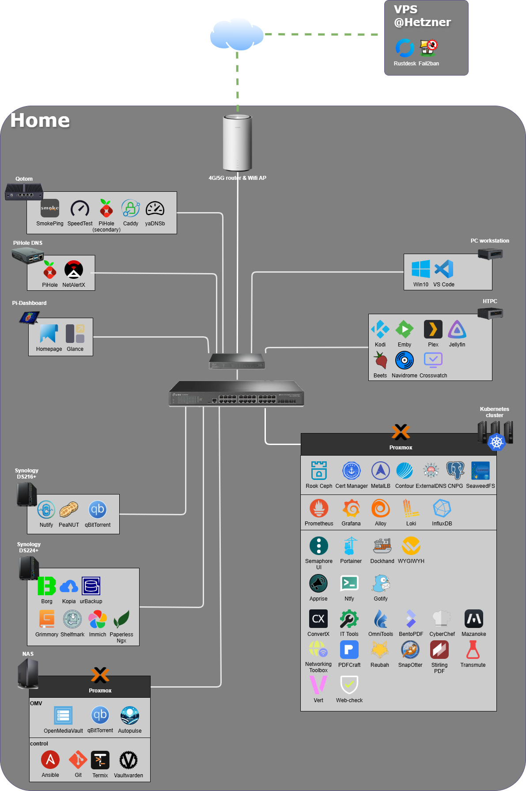

# Homelab by Zoltan Kutasi

This repository is the home of my homelab and various scripts and tool configs for it.
Separate README files are placed in each selected folder to further emphasize how the specific component can be used.

## Overview

All of this is a work in progress. The hardware is more or less final,
but the Infrastructure as Code aspects will evolve as well as the hosted Services will grow.

### Hardware

- 1x Digitus DN-19 16U-6/6-SW Rack & a bunch of extra stuff for it
- 1x TP-Link TL-SG3428X 24 Port Gigabit Switch + 4 Port SFP+
- 1x TP-Link TL-SG2008P JetStream 8 Port Gigabit Smart Switch PoE
- 3x Dell Optiplex Micro 7060 with i5-8500T, 32GB RAM, 256GB SSD + 1TB SSD
- 1x Synology 216+II with 2x6TB HDD
- 1x Synology 224+ with 2x12TB HDD
- 2x Raspberry Pi 4 32GB SD
- 1x Eaton Ellipse PRO 1600 DIN 1600VA UPS
- 1x External VPS with 1 vCPU and 512MB RAM
- 1x Intel NUC Kit 7i3DNHE with i3-7100U, 16GB RAM, 500GB SSD
- 1x Intel NUC Kit 7i3BNH with i3-7100U, 8GB RAM, 256GB SSD
- 1x Self-built tower PC
  - Motherboard:
  - CPU: Intel Pentium G4560
  - RAM: 32GB
  - Storage: 256GB SSD + 8x 8TB HDD

And a bunch of smaller stuff.

They consist of:

- 3x Dell Optiplex for a Kubernetes cluster
- 1x Synology NAS for Music
- 1x Synology NAS for Documents, Photos and work related stuff
- 1x Raspberry Pi 4 for PiHole DNS
- 1x Raspberry Pi 4 for a Dashboard screen
- 1x Qotom small appliance machine with 4x1Gbps Ethernet ports
- 1x VPS for essential things to host remotely (RustDesk for example)
- 1x NUC for HTPC purposes
- 1x NUC for private stuff (Windows)
- 1x Self-build tower PC for NAS with Movies, TVShows and co.

### Tech stacks

#### General tools

These are fundamental or general tools I built my infrastructure on or use it across the whole homelab.

| Logo | Name | Description |
|------|------|-------------|
|  | [Ansible](https://www.ansible.com) | Automate bare metal provisioning and configuration on every machine |
|  | [Docker](https://www.docker.com/) | Containerize everything, using Docker Compose |
|  | [Proxmox](https://www.proxmox.com) | Provide the virtualization layer on bigger hardware units |
|  | [Terraform](https://developer.hashicorp.com/terraform) | Create VMs on top of Proxmox |
|  | [Ubuntu Server](https://ubuntu.com/server) | Base OS for anything requiring one |

#### Networking stack

| Logo | Name | Description |
|------|------|-------------|
|  | [Pihole](https://pi-hole.net/) | Network-wide Ad Blocking and local DNS server |
|  | [Unbound](https://www.nlnetlabs.nl/projects/unbound/about/) | Used with Pihole, to bypass public DNS Servers |
|| [Nebula-sync](https://github.com/lovelaze/nebula-sync) | Synchronize configuration of multiple Pi-hole v6.x instances |
|  | [Caddy](https://github.com/caddyserver/caddy) | A state of the art reverse proxy with modular design and extensibility, while still maintaining a lightweight structure and simplicity |

#### Backups stack

| Logo | Name | Description |
|------|------|-------------|
|  | [Borgmatic](https://torsion.org/borgmatic/) | Handle the backups themselves on each host |
|  | [Borgwarehouse](https://borgwarehouse.com/) | Provides the Borg repo over SSH and a WebUI |
|  | [Kopia](https://kopia.io/) | A relative new contender, with cool features like supporting multiple hosts, has a great webUI |
|  | [UrBackup](https://www.urbackup.org/) | A Client-Server architecture backup solution, where the design clearly has built in multi-host support |
|  | [Portabase](https://portabase.io/) | Database backup & restore tool for PostgreSQL, MySQL, MariaDB, Firebird SQL, SQLite, MongoDB, Redis and Valkey |
|  | [Databasus](https://databasus.com/) | Database backup tool (PostgreSQL, MySQL\MariaDB and MongoDB) |

#### Kubernetes infrastructure stack

| Logo | Name | Description |
|------|------|-------------|
|  | [Kubernetes](https://kubernetes.io/) | Orchestrate containerized applications |
|  | [Helm](https://helm.sh/) | A package manager for Helm |
|  | [Rook Ceph](https://rook.io) | Cloud-Native Storage for Kubernetes |
|  | [MetalLB](https://metallb.io/) | Bare metal load-balancer for Kubernetes, for those External IPs |
|  | [Cert Manager](https://cert-manager.io/) | Cloud native certificate management, using self signed certs as well as Let's Encrypt ones |
|  | [Contour](https://projectcontour.io/) | Ingress Controller for the services exposed |
|  | [ExternalDNS](https://github.com/kubernetes-sigs/external-dns) | Synchronizes exposed Kubernetes Services and Ingresses (Contour HTTPProxies too) with DNS providers (Pihole too) |
|  | [Cloud Native PostgreSQL](https://cloudnative-pg.io/) | A Kubernetes native way to run PSQL instances |
|  | [SeaweedFS](https://seaweedfs.com/) | SeaweedFS is a distributed storage system for object storage (S3), file systems, and Iceberg tables, designed to handle billions of files with O(1) disk access and effortless horizontal scaling |

#### Media stack

Manage my Movies, Music, Books, Photos and all media files.

| Logo | Name | Description |
|------|------|-------------|
|  | [OpenMediaVault](https://www.openmediavault.org/) | A very lightweight NAS OS based on Debian Linux, and supports a few main NAS functionalities via plugins like NFS, Samba, Snapraid or even MergerFS |
|  | [Emby](https://emby.media/) | Host my Media files through a Web Interface or just through the TV |
|  | [Kodi](https://kodi.tv/) | An addon based Media playback software for HTPCs. |
|  | [Plex](https://www.plex.tv/) | Alternative to Emby, but I just use it for testing and deduplication |
|  | [Jellyfin](https://jellyfin.org/) | The Free Software Media System - Server Backend & API |
|  | [Crosswatch](https://github.com/cenodude/CrossWatch) | A synchronization engine that keeps your Plex, Jellyfin, Emby, SIMKL, Trakt, AniList, MDBList and Tautulli in sync |
|  | [Autopulse](https://autopulse.dancodes.online/autopulse/) | Automated scanning tool that integrates widely-used media management services with various media servers for seamless media organization |
|  | [Beets](https://beets.io/) | Music metadata improver |
|  | [Grimmory](https://grimmory.org/) | Grimmory is an independent community fork of Booklore |
|  | [Shelfmark](https://github.com/calibrain/shelfmark) | A unified web interface for searching and aggregating books and audiobook downloads from multiple sources |
|  | [Immich](https://immich.app/) | Easily back up, organize, and manage your photos on your own server. Immich helps you browse, search and organize your photos and videos with ease, without sacrificing your privacy |
|  | [Navidrome](https://www.navidrome.org/) | An open source web-based music collection server and streamer. It gives you freedom to listen to your music collection from any browser or mobile device. It's like your personal Spotify! |
|  | [Paperless-NGX](http://docs.paperless-ngx.com/) | A community-supported supercharged document management system: scan, index and archive all your documents |

#### Monitoring stack

| Logo | Name | Description |
|------|------|-------------|
|  | [Alloy](https://grafana.com/docs/alloy/latest/) | Collect logs from any source and transfer it to Loki |
|  | [Prometheus](https://prometheus.io) | Collect metrics from all hosts with various exporters |
|  | [Loki](https://grafana.com/oss/loki/) | A Log Aggregation system with Grafana integration |
|  | [Grafana](https://grafana.com) | Visualize metrics and other sources of information |
|  | [InfluxDB](https://www.influxdata.com/) | A Time Series database from InfluxData |
|  | [Beszel](https://beszel.dev/) | A lightweight server monitoring platform that includes Docker statistics, historical data, and alert functions. It supports automatic backup, multi-user, OAuth authentication, and API access |
|  | [Gatus](https://gatus.io/) | Gatus is a developer-oriented health dashboard that gives you the ability to monitor your services using HTTP, ICMP, TCP, and even DNS queries |
|  | [PatchMon](https://patchmon.net/) | Linux Patch Management & Automation Platform |
|  | [Network UPS Tools](https://networkupstools.org/) | Connect the UPS to the internal Network and make it reusable |
|  | [Nutify](https://github.com/DartSteven/Nutify) | An all in one solution with a NUT Server and a dashboard, with additional functionality as well |
|  | [PeaNUT](https://github.com/Brandawg93/PeaNUT) | A tiny dashboard for the NUT Server |
|  | [Speedtest tracker](https://github.com/alexjustesen/speedtest-tracker) | Measure internet speed, latency and get notified if something happens |
|  | [SmokePing](https://oss.oetiker.ch/smokeping/) | A tool to periodically check ping stats for multiple remote hosts, continuously |
|  | [YaDNSb](https://github.com/butialabs/yadnsb) | A DNS tester app, that runs various tests to various well-known DNS servers |
|| [Arpwatch](https://www.kali.org/tools/arpwatch/) | Maintains a database of Ethernet MAC addresses seen on the network, with their associated IP pairs. Alerts the system administrator via e-mail if any change happens |
|  | [NetAlertX](https://netalertx.com/) | A network presence and alerting framework |
|  | [Glances](https://github.com/nicolargo/glances) | An Eye on your system. A top/htop alternative for GNU/Linux, BSD, Mac OS and Windows operating systems |

#### Notifications stack

Everything goes through Apprise and fan out into the push services. Every notification/email worth it becomes a push event. Or an Alert in Prometheus/Alertmanager.

| Logo | Name | Description |
|------|------|-------------|
|  | [Apprise](https://appriseit.com/) | Push Notifications that work with just about every platform! |
|  | [Pushover](https://pushover.net/) | Pushover makes it easy to get real-time notifications on your Android, iPhone, iPad, and Desktop (Android Wear and Apple Watch, too!) |
|  | [Ntfy](https://ntfy.sh/) | Send push notifications to your phone or desktop using PUT/POST |
|  | [Gotify](https://gotify.net/) | A simple server for sending and receiving messages in real-time per WebSocket. (Includes a sleek web-ui) |
|| [Mailrise](https://mailrise.xyz/) | An SMTP gateway for Apprise notifications |
|  | [Alertmanager](https://prometheus.io/docs/alerting/latest/alertmanager/) | Handles alerts sent by client applications such as the Prometheus server. It takes care of deduplicating, grouping, and routing them to the correct receiver integration such as email, PagerDuty, or OpsGenie. It also takes care of silencing and inhibition of alerts. |

#### Management stack

These are services that allow me to manage certain aspects of the infrastructure, being containers, remote desktop, SSH, network or any hardware, like a UPS.

| Logo | Name | Description |
|------|------|-------------|
|  | [DockHand](https://dockhand.pro) | A modern take on docker management, for homelabs mostly. Low footprint |
|  | [Portainer](https://www.portainer.io/) | Manage docker containers and compose stacks from a central place |
|  | [RustDesk](https://rustdesk.com/) | A remote access software, capable of using its own Relay server, connecting two even CGNAT-ed or double-NAT-ed machines |
|  | [Termix](https://docs.termix.site/) | A clientless web-based server management platform with SSH terminal, tunneling, and file editing capabilities |

#### Others

| Logo | Name | Description |
|------|------|-------------|
|  | [Homepage](https://gethomepage.dev/) | A highly customizable homepage (or startpage / application dashboard) with Docker and service API integrations |
|  | [Glance](https://github.com/glanceapp/glance) | A self-hosted dashboard that puts all your feeds in one place |
|  | [WYGIWYH](https://github.com/eitchtee/WYGIWYH) | A no-budget approach to expense tracking. Just (periodically) import your CSVs (do not forget to pre-create most things you need) and glance at the Sankey diagram |
|  | [ConvertX](https://github.com/C4illin/ConvertX) | Convert anything into something else |
|  | [IT Tools](https://github.com/CorentinTh/it-tools) | IT swiss army knife |
|  | [Omni Tools](https://github.com/iib0011/omni-tools) | Various useful tools |
|  | [BentoPDF](https://www.bentopdf.com) | A powerful, privacy-first, client-side PDF toolkit that is self hostable and allows you to manipulate, edit, merge, and process PDF files directly in your browser |
|  | [Cyberchef](https://github.com/gchq/CyberChef) | CyberChef is a simple, intuitive web app for carrying out all manner of "cyber" operations within a web browser |
|  | [Mazanoke](https://mazanoke.com/) | A self-hosted local image optimizer that runs in your browser |
|  | [Networking Toolbox](https://github.com/lissy93/networking-toolbox) | 100+ offline-first networking tools and utilities |
|  | [PDFCraft](https://pdfcraft.devtoolcafe.com/) | A free, privacy-focused PDF toolkit that runs entirely in your browser. With 90+ professional tools, you can edit, convert, merge, split, and secure your PDF files without ever uploading them to a server |
|  | [Reubah](https://github.com/dendianugerah/reubah) | A simple web-based tool for processing images and converting documents with a simple interface |
|  | [SnapOtter](https://snapotter.com/) | The open-source image suite that makes paid tools nervous. Every image tool you need. Your images stay yours |
|  | [Stirling PDF](https://www.stirlingpdf.com/) | A free alternative to the Adobe PDF suite with helpful tools to manipulate and read PDF files |
|  | [Transmute](https://transmute.sh/) | Self hosted file converter for images, video, audio, json, excel and more. Supports over 2,000 conversions! |
|  | [Vert](https://vert.sh/) | The next-generation file converter. Open source, fully local* and free forever. |
|  | [Web-Check](https://web-check.xyz/) | All-in-one OSINT tool for analysing any website |

### Development

I am using VS Code, with a few plugins and tricks:

- Remote SSH - Writing code on my Windows PC, but using it to enter into a Linux host that has a few things installed (Git, Ansible, Terraform, Kubernetes toolings, etc...)
- Drawing pictures with Draw.io
- Github Copilot - To help me with some code completion and writing faster
- Vscode-sops - Encrypting secrets in the repository with [SOPS](https://github.com/getsops/sops) and [age](https://github.com/FiloSottile/age)
- Support for Jinja, Python, Ansible and any languages required
- Run Terminal Command - A simple extension to allow me to run arbitrary commands by right clicking on files in the Explorer window.
